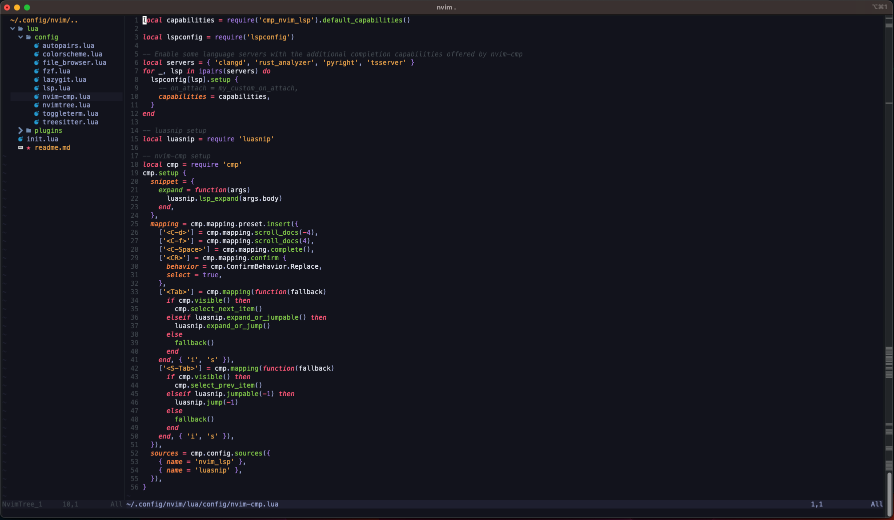
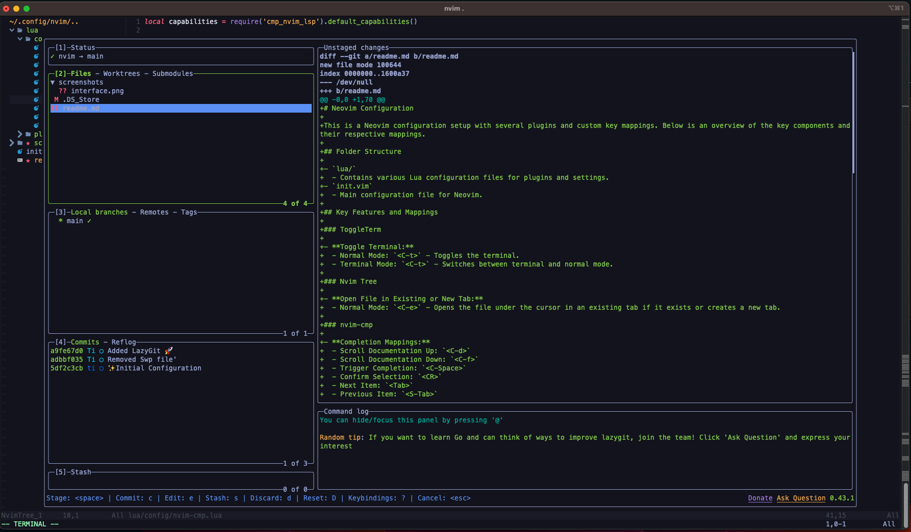

# Neovim Configuration

This is a Neovim configuration setup with several plugins and custom key mappings. Below is an overview of the key components and their respective mappings.

## Key Features and Mappings

### ToggleTerm

- **Toggle Terminal:**
  - Normal Mode: `<C-t>` - Toggles the terminal.
  - Terminal Mode: `<C-t>` - Switches between terminal and normal mode.

### Nvim Tree

- **Open File in Existing or New Tab:**
  - Normal Mode: `<C-e>` - Opens the file under the cursor in an existing tab if it exists or creates a new tab.

### nvim-cmp

- **Completion Mappings:**
  - Scroll Documentation Up: `<C-d>`
  - Scroll Documentation Down: `<C-f>`
  - Trigger Completion: `<C-Space>`
  - Confirm Selection: `<CR>`
  - Next Item: `<Tab>`
  - Previous Item: `<S-Tab>`

### LSP Configurations

- **Diagnostic Key Mappings:**
  - Show Diagnostic Floating Window: `<space>e`
  - Go to Previous Diagnostic: `[d`
  - Go to Next Diagnostic: `]d`
  - Set Diagnostic Location List: `<space>q`

- **LSP Key Mappings (per buffer):**
  - Go to Declaration: `gD`
  - Go to Definition: `gd`
  - Hover Documentation: `K`
  - Go to Implementation: `gi`
  - Signature Help: `<C-k>`
  - Add Workspace Folder: `<space>wa`
  - Remove Workspace Folder: `<space>wr`
  - List Workspace Folders: `<space>wl`
  - Type Definition: `<space>D`
  - Rename Symbol: `<space>rn`
  - Code Actions: `<space>ca`
  - Find References: `gr`
  - Format Document: `<space>f`

### LazyGit

- **Open LazyGit:**
  - Normal Mode: `<leader>gg` - Opens LazyGit.

### FZF

- **FZF Key Mappings:**
  - Lines Search: `<C-f>`
  - Ripgrep Search: `<C-a>`
  - File Search: `<C-p>`

## Screenshots

### Interface

### LazyGit

